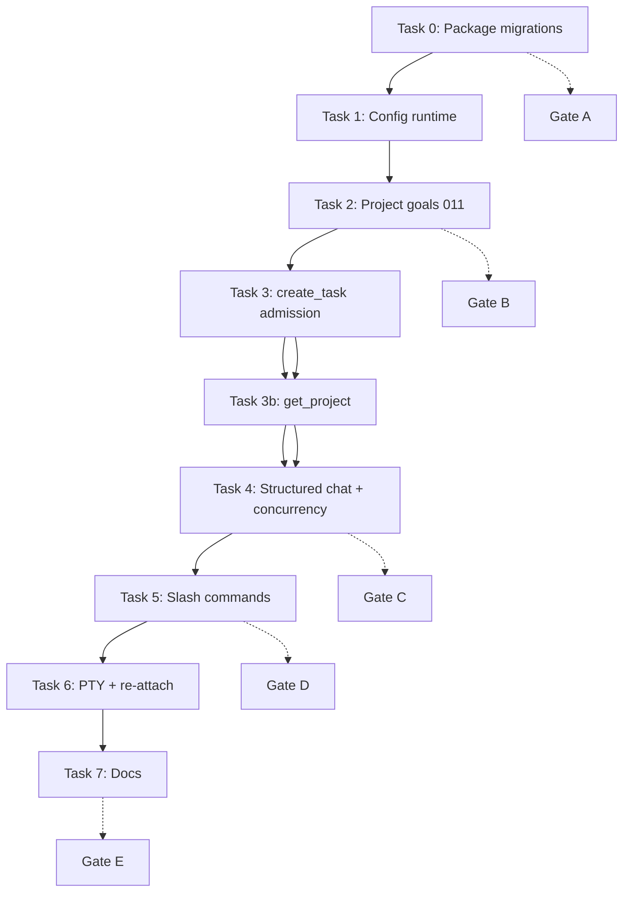

# Phase 5: Commander Intelligence Integration Implementation Plan

> **For agentic workers:** REQUIRED SUB-SKILL: Use superpowers:subagent-driven-development (recommended) or superpowers:executing-plans to implement this plan task-by-task. Steps use checkbox (`- [ ]`) syntax for tracking.

**Goal:** Connect Wave 4's TUI/Supervisor shell to the real Commander service so `chat.send` produces intelligent responses, admits safe task drafts into the existing pipeline, and exposes minimal `/goal`, `/status`, `/tasks`, and `/logs` commands per project.

**Architecture:** Fix wheel packaging and runtime config resolution first (P0). Add project-scoped goals (migration 011). Refactor `commander_service` to return structured `CommanderChatResult` so the Supervisor bridge can emit `task.created` and `commander.completed` events. Introduce `supervisor_commander` as the only place that maps Commander outcomes to broker events. TUI remains a thin client.

**Tech Stack:** Python 3.11+, SQLite migrations via `importlib.resources`, `commander_runner`/`commander_service`, Supervisor JSON-RPC (per-client threads), Ink TUI, unittest + PTY integration tests.

**Baseline:** `external/coordinator-global-tui` at or after `c290ce2`. Do **not** modify migrations `007`–`010`; add `011` only to the **authoritative** migrations directory (see Task 0).

**Plan revision:** 2026-06-23 r3 — r2 + Gemini/Claude residual fixes: Task 0 Step 4 wheel-test isolation (no false green), Task 2 locked goal API signatures, Task 4 busy-check ordering + SQLite WAL verify-first, `_admit_task_proposal` verify-before-delete.

**Verdict (r3):** Operator quick review → then start Task 0. r3 fixes the remaining plan-text blockers; no code changes in this revision.

---

## Ownership and Codex Gates

| Role | Responsibility |
|------|----------------|
| **Grok** | Primary implementer; one focused commit per numbered task |
| **Claude Code** | Read-only adversarial review after each task; rejected work returns to Grok |
| **Codex** | Integration gates only at the milestones below |

**Codex gates (single canonical list):**

| Gate | After task | What Codex re-runs |
|------|------------|-------------------|
| **Gate A — P0 install** | Task 0 | Mirror sync under `PYTHONPATH=src`; `test_wheel_migrations` only in **fresh venv after pip install wheel** (no `PYTHONPATH`); `init_db` creates `tasks`; `coordinator supervisor start` with seeded global config |
| **Gate B — schema + goals** | Task 2 | Migration mirror sync test; `init_db` applies 001–011; project-scoped goals |
| **Gate C — Commander chat** | Task 4 | `chat.send` structured result; `task.created` / `commander.completed` events; concurrency test (status while chat blocked) |
| **Gate D — slash commands** | Task 5 | `/goal`, `/status`, `/tasks`, `/logs` RPC + PTY visibility |
| **Gate E — Phase 5 final** | Task 7 | Full release suite + real-project smoke (incl. re-attach without re-onboarding) |

**Branch model:** `external/coordinator-commander-intelligence` from `c290ce2`, or continue on `external/coordinator-global-tui` until PR #1 merges.

---

## Current Gaps (from Wave 4 + real install trial)

1. **Wheel migrations missing** — `db.MIGRATIONS_DIR` points outside the package; wheel has no `*.sql`.
2. **XDG config loader brittle** — empty global config → wrong `~/.config/config/agents.toml` path.
3. **`chat.send` is a stub** — echoes `Received: {text}` only.
4. **Goals are global** — one non-terminal goal for all projects.
5. **Admission ignores `project_id`** — `_insert_ready_task` hand-inserts rows without `project_id`.
6. **`send_chat_message` returns `str` only** — bridge cannot emit admission/run events.
7. **Slash commands unimplemented** — TUI registers methods Supervisor lacks.
8. **`project.status` false negatives** — treats registered projects with zero tasks as "not found".
9. **Docs overpromise** — `docs/tui.md` says "chatting with Commander" but Wave 4 only echoes.
10. **`get_project()` missing** — `projects.py` has `find_project_by_path` / `list_projects` only; plan handlers assume `get_project(conn, project_id)`.

---

## Migrations Directory Policy (locked)

| Location | Role |
|----------|------|
| `src/local_cli_coordinator/migrations/*.sql` | **Authoritative runtime directory** — sole source `init_db` reads via `importlib.resources` |
| `migrations/*.sql` (repo root) | **Dev/CI mirror** — human-friendly path; must stay byte-identical to authoritative copy |

**Rules for every new migration (including 011):**

1. Add SQL file under `src/local_cli_coordinator/migrations/` first.
2. Copy to root `migrations/` (same filename).
3. `tests/test_migration_mirror_sync.py` fails CI if sets differ or content diverges.
4. Never add a migration only on one side.

Optional helper (Task 0): `scripts/sync_migrations.sh` copies authoritative → root.

### Runtime loading — `Traversable`, not `Path.glob` (locked)

**Do not** cast `importlib.resources.files(...)` to `Path` and call `.glob("*.sql")`. Installed wheels may be zip-backed; that pattern fails at runtime.

**Modify:** `src/local_cli_coordinator/db.py`

```python
from importlib.abc import Traversable
from importlib import resources

def iter_migration_scripts(migrations_root: Traversable | Path | None = None):
    """Yield (version_name, sql_text) sorted by version filename."""
    root = migrations_root or resources.files("local_cli_coordinator") / "migrations"
    names = sorted(
        entry.name for entry in root.iterdir()
        if entry.name.endswith(".sql")
    )
    for name in names:
        yield name, (root / name).read_text(encoding="utf-8")


def init_db(conn: sqlite3.Connection, migrations_root: Traversable | Path | None = None) -> None:
    ...
    for name, script in iter_migration_scripts(migrations_root):
        ...
```

- Dev/editable installs may still pass `Path("migrations")` in tests — `iterdir()` + `read_text()` must work for both `Traversable` and `Path` (use a small protocol or branch on `hasattr(root, "glob")` only in tests, not production wheel path).
- Gate A must run against **installed wheel in fresh venv**, not `PYTHONPATH=src` only.

---

## Commander Service API (locked before Task 4)

### Problem

`send_chat_message()` today returns a formatted `str` and calls `admit_commander_response()` internally. The Supervisor bridge needs `run_id`, `goal_id`, and `CommanderAdmissionResult` to publish `task.created` and `commander.completed`.

### Structured result

**Modify:** `src/local_cli_coordinator/commander_service.py`

```python
@dataclass(frozen=True)
class CommanderChatResult:
    message: str
    goal_id: int
    run_id: int | None
    admission: CommanderAdmissionResult | None
    succeeded: bool


def send_project_chat_message(
    conn: sqlite3.Connection,
    config: CoordinatorConfig,
    root: Path,
    goal_id: int,
    content: str,
    *,
    project_id: str,
    reporter: Reporter = NULL_REPORTER,
) -> CommanderChatResult:
    """Run Commander chat trigger, admit proposals, return structured outcome."""


def send_chat_message(...) -> str:
    """CLI wrapper — calls send_project_chat_message, returns .message only."""
```

`admit_commander_response(..., project_id: str = "legacy-default")` — **optional param with existing default** so CLI/daemon call sites do not break. TUI path always passes the real `project_id`.

### Admission `project_id` call chain (locked)

```
send_project_chat_message(..., project_id="proj-a")
  → admit_commander_response(..., project_id=project_id)
    → create_task(..., project_id=project_id)   # replaces _insert_ready_task hand INSERT
      → tasks.project_id + events.project_id set together
```

- `db.create_task()` already accepts `project_id="legacy-default"` — **keep default**; do not make it required.
- Root bug today: `commander_policy._insert_ready_task()` hand-inserts `tasks`/`events` and omits `project_id` entirely.
- Task 3 removes `_insert_ready_task` body; no parallel insert path.
- `goal_id` stays on `task_goal_links` / `commander_messages` as today — `project_id` scopes execution rows, not goal FKs.

**`_admit_task_proposal` (verify before delete):** As of baseline `c290ce2`, `commander_service.py` defines `_admit_task_proposal` at ~line 421 but **no call sites** (grep shows definition only). Do **not** add a delete step unless re-verified at implementation time. If still dead after Task 3 admission refactor, optional cleanup commit may remove it — not a gate blocker.

### Bridge event mapping (Task 4)

```python
def publish_commander_chat_events(
    broker: EventBroker,
    conn: sqlite3.Connection,
    project_id: str,
    result: CommanderChatResult,
) -> None:
    broker.publish(conn, project_id, "chat.message", {"role": "coordinator", "text": result.message, "goal_id": result.goal_id})
    if result.run_id is not None:
        broker.publish(conn, project_id, "commander.completed", {
            "goal_id": result.goal_id,
            "run_id": result.run_id,
            "admitted": len(result.admission.accepted_task_ids) if result.admission else 0,
            "rejected": len(result.admission.rejection_reasons) if result.admission else 0,
        })
    if result.admission:
        for task_id in result.admission.accepted_task_ids:
            broker.publish(conn, project_id, "task.created", {"task_id": task_id, "goal_id": result.goal_id})
```

---

## `/goal` and `chat.send` Semantics (locked)

| Action | Allowed when | Behavior |
|--------|--------------|----------|
| `/goal` (no args) | project registered | Return goal status JSON (or "no goal") |
| `/goal <objective>` | no non-terminal goal for project | `create_and_preview_goal(..., project_id=...)` → **draft** + Commander preview |
| `/goal confirm` | goal status == `draft` and preview succeeded | `confirm_goal` → **active** |
| `chat.send` | goal status == **`active` only** | `send_project_chat_message` |

**Explicitly rejected:**

- `chat.send` with **draft** goal → error + system message: *"Goal is draft. Run /goal confirm before chatting."*
- `chat.send` with no goal → error: *"No active goal. Use /goal <objective> then /goal confirm."*
- `chat.send` with `paused` / `blocked` → error with resume hint

**Rationale:** Draft goals have unconfirmed Commander preview; allowing chat would admit tasks against an unactivated objective. Tests must cover draft-chat rejection (Task 5).

---

## Synchronous Commander RPC — Concurrency Contract (Phase 5)

Phase 5 keeps **synchronous** `chat.send` (up to 120s). Mitigation is not only a "thinking" event.

**SupervisorServer** already handles each client connection on its own thread (`supervisor_server.py`). Phase 5 must preserve:

1. **Fast busy response (before any "thinking" event)** — if `has_live_commander_run(goal_id)`, `_handle_chat_send` must return within 1s with `CommanderChatResult.succeeded=False` and a busy message **before** publishing `chat.message` `{ role: "system", text: "Commander is thinking…" }`. No second 120s wait; no misleading thinking indicator while busy.
2. **Cross-request liveness** — while client A's `chat.send` blocks on a slow mock Commander, client B's `project.status` on the **same** project returns within 5s.
3. **Timeout hygiene** — Commander timeout publishes `commander.completed` with `succeeded=false`; TUI socket stays connected; user can run `/status`.

**Tests (Task 4, mandatory):**

- `test_chat_send_busy_returns_immediately_when_commander_active` (assert no `"Commander is thinking…"` system event)
- `test_project_status_responds_while_chat_commander_blocks` (mock `run_commander` sleep 10s in thread A; thread B status)
- `test_chat_timeout_does_not_kill_supervisor_ping`

**Out of scope for Phase 5:** async Commander job queue with push events (document as Phase 5.1).

---

## Interface Design: `chat.send` → Commander

### RPC contract

**Request:** `chat.send`, `params: { text: string }`, envelope `project_id`.

**Success:** `{ received: true, goal_id: int, commander_run_id: int | null, admitted: int, rejected: int }`

**Failure:** `ok: false`, error string; optional `chat.message` system role already published.

### Server-side flow

```
_handle_chat_send
  → get_project(conn, project_id)  # projects table; 404 if missing
  → goal = active_goal_for_project(conn, project_id)
  → require goal.status == "active"  # see semantics table
  → if has_live_commander_run(goal["id"]): return busy error immediately  # BEFORE thinking event
  → broker.publish chat.message { role: "user", text }
  → broker.publish chat.message { role: "system", text: "Commander is thinking…" }
  → result = send_project_chat_message(..., project_id=project_id)
  → publish_commander_chat_events(broker, conn, project_id, result)
  → return structured RPC result
```

### `project.status` fix (Task 5)

```python
def _handle_project_status(...):
    if get_project(conn, project_id) is None:
        return self._error(request, f"project {project_id!r} not registered")
    counts = project_task_counts(conn, project_id=project_id)
    goal = active_goal_for_project(conn, project_id)  # may be None
    ...
```

Never infer project existence from task rows.

### `project.logs` (Task 5)

Read **global** runtime paths only:

```python
from .supervisor_process import supervisor_log_path
log_tail = supervisor_log_path(paths).read_text()[-4000:]
```

Plus last `commander_runs` row for project's active goal. Do not read `{repo}/supervisor.log`.

---

## Event Stream and Memory Strategy

| Store | What |
|-------|------|
| `commander_messages` | User + assistant turns (durable) |
| `commander_runs` | Run metadata |
| `tasks` + `task_goal_links` | Admitted work |
| `supervisor_events` | `chat.message`, `task.created`, `commander.completed` |

**Not in Phase 5:** `state/loop_state.md` writes from TUI path.

**Reconnect:** `events.replay` must include chat + commander events (Task 6).

### Chat role naming — DB vs TUI events (locked)

| Layer | User | Commander reply |
|-------|------|-----------------|
| `commander_messages.role` | `"user"` | `"assistant"` (unchanged DB convention) |
| `supervisor_events` `chat.message` payload | `"user"` | `"coordinator"` (product label in TUI) |
| TUI transcript reducer | `user` | `coordinator` |

Bridge maps: `add_commander_message(..., "assistant", text)` **and** `broker.publish(..., {"role": "coordinator", "text": ...})`.

**Tests:** assert DB `assistant`; assert event payload `coordinator`; do not mix them in one assertion.

---

## File Map

| File | Change |
|------|--------|
| `pyproject.toml` | Package `migrations/*.sql` under `local_cli_coordinator` |
| `src/local_cli_coordinator/migrations/` | Authoritative SQL; receive copy of 001–010 + new 011 |
| `migrations/` (root) | Mirror only |
| `src/local_cli_coordinator/db.py` | `iter_migration_scripts()` / `Traversable`-safe `init_db` |
| `src/local_cli_coordinator/config.py` | Add `load_config_from_dir(config_dir: Path)` native flat layout |
| `src/local_cli_coordinator/config_runtime.py` | **New** — `load_config_for_paths(paths)` → calls `load_config_from_dir` |
| `src/local_cli_coordinator/projects.py` | **New** `get_project(conn, project_id)` (Task 3b) |
| `src/local_cli_coordinator/commander_service.py` | `CommanderChatResult`, `send_project_chat_message` |
| `src/local_cli_coordinator/commander_policy.py` | `admit_commander_response` uses `db.create_task(project_id=...)` |
| `src/local_cli_coordinator/supervisor_commander.py` | **New** — bridge + event publish |
| `src/local_cli_coordinator/supervisor_methods.py` | Real handlers |
| `src/local_cli_coordinator/projects.py` | `get_project` |
| `tests/test_migration_mirror_sync.py` | **New** |
| `tests/test_commander_chat_concurrency.py` | **New** — Gate C tests |

---

### Task 0 (P0): Authoritative package migrations + mirror sync

**Files:**
- Create: `src/local_cli_coordinator/migrations/` (copy 001–010 from root)
- Modify: `pyproject.toml`, `src/local_cli_coordinator/db.py`
- Create: `tests/test_wheel_migrations.py`, `tests/test_migration_mirror_sync.py`
- Optional: `scripts/sync_migrations.sh`

- [ ] **Step 1: Write failing mirror sync test**

```python
# tests/test_migration_mirror_sync.py
AUTH = ROOT / "src" / "local_cli_coordinator" / "migrations"
MIRROR = ROOT / "migrations"

def test_migration_mirror_matches_authoritative(self):
    auth = {p.name: p.read_bytes() for p in AUTH.glob("*.sql")}
    mir = {p.name: p.read_bytes() for p in MIRROR.glob("*.sql")}
    self.assertEqual(set(auth), set(mir))
    for name, body in auth.items():
        self.assertEqual(body, mir[name], name)
```

- [ ] **Step 2: Write failing wheel test** — installed wheel `init_db` creates `tasks` table (no PYTHONPATH).

- [ ] **Step 3: Implement**

- Populate `src/local_cli_coordinator/migrations/` from root (one-time copy).
- `db.py`: implement `iter_migration_scripts()` + `init_db` using `Traversable.iterdir()` / `read_text()` — **no** `Path(resources.files(...)).glob`.
- `pyproject.toml`: `local_cli_coordinator = ["tui_bundle/*", "migrations/*.sql"]`.
- `test_wheel_migrations`: build wheel, **fresh venv pip install**, run `init_db` — no `PYTHONPATH`.
- Document: new migrations → authoritative first → `scripts/sync_migrations.sh` → mirror.

- [ ] **Step 4: Run tests — PASS**

**Do not** run `test_wheel_migrations` under `PYTHONPATH=src` — that resolves the package from the source tree and bypasses the wheel install (false green).

```bash
# 4a — mirror sync only (editable / CI dev path)
PYTHONPATH=src python3 -m unittest tests.test_migration_mirror_sync -v

# 4b — build wheel
python3 -m build --wheel

# 4c — wheel migrations in isolated venv (Gate A truth path)
python3 -m venv /tmp/coord-wheel-test
/tmp/coord-wheel-test/bin/pip install dist/local_cli_coordinator-*.whl
env -u PYTHONPATH /tmp/coord-wheel-test/bin/python -m unittest tests.test_wheel_migrations -v
```

**Alternative (also valid):** `test_wheel_migrations.py` itself creates a temp venv, `pip install`s the built wheel, spawns a subprocess with `PYTHONPATH` explicitly cleared, and asserts `init_db` creates `tasks`. If implemented that way, Step 4c collapses into a single `python3 -m unittest tests.test_wheel_migrations -v` — but the test body must enforce isolation; never rely on parent-shell `PYTHONPATH=src`.

- [ ] **Step 5: Commit**

```bash
git commit -m "fix: package authoritative SQL migrations for wheel installs"
```

**→ Codex Gate A**

---

### Task 1: Native XDG config loader (no temp shim)

**Files:**
- Modify: `src/local_cli_coordinator/config.py`
- Create: `src/local_cli_coordinator/config_runtime.py`
- Modify: `src/local_cli_coordinator/cli.py`, `src/local_cli_coordinator/supervisor_methods.py`
- Create: `tests/test_config_runtime.py`

**Do not** copy flat `~/.config/coordinator/*.toml` into a temporary `root/config` tree. Native flat layout instead.

- [ ] **Step 1: Write failing test**

```python
def test_load_config_from_dir_reads_flat_xdg_files(tmp_path):
    config_dir = tmp_path / "coordinator"
    config_dir.mkdir()
    (config_dir / "agents.toml").write_text('[agents.w]\ncommand = "true"\nrole = "worker"\n')
    (config_dir / "repos.toml").write_text('[repos.demo]\npath = "/tmp/demo"\n')
    (config_dir / "policy.toml").write_text(
        "[task_policy]\nrequire_single_repo = false\n"
        "require_acceptance_criteria = false\nrequire_verification_commands = false\n"
    )
    cfg = load_config_from_dir(config_dir)
    assert "w" in cfg.agents
    assert "demo" in cfg.repos

def test_load_config_for_paths_uses_runtime_paths_config_dir(tmp_path):
    paths = RuntimePaths(config_dir=tmp_path/"config", data_dir=tmp_path/"data", state_dir=tmp_path/"state")
    # seed same flat files under paths.config_dir
    cfg = load_config_for_paths(paths)
    assert cfg.agents
```

- [ ] **Step 2: Implement `load_config_from_dir(config_dir: Path)` in `config.py`**

Reads `agents.toml`, `repos.toml`, `policy.toml`, optional `discovery.toml` / `connectors.toml` **directly** from `config_dir` (no `root/config` nesting). Refactor existing `load_config(root)` to call `load_config_from_dir(root / "config")` so legacy repo layout still works.

- [ ] **Step 3: `config_runtime.load_config_for_paths(paths)`** — one-liner wrapper.

- [ ] **Step 4: Replace** `cli.py:_cmd_supervisor_start` temp-dir shim with `load_config_for_paths(paths)`.

- [ ] **Step 5: Run tests — PASS**; commit.

```bash
PYTHONPATH=src python3 -m unittest tests.test_config_runtime tests.test_supervisor_server -v
git commit -m "fix: load flat XDG config natively for Supervisor"
```

---

### Task 2: Project-scoped goals (migration 011)

**Files:**
- Create: `src/local_cli_coordinator/migrations/011_project_goals.sql`
- Mirror: `migrations/011_project_goals.sql` (via sync script)
- Modify: `src/local_cli_coordinator/goals.py`, `src/local_cli_coordinator/commander_service.py`

**Locked implementation — function signatures (do not improvise):**

Migration `011` adds `goals.project_id text not null default 'legacy-default'` and enforces **at most one non-terminal goal per project** (partial unique index or equivalent).

**Modify:** `src/local_cli_coordinator/goals.py`

```python
def create_goal(
    conn: sqlite3.Connection,
    title: str,
    objective: str,
    *,
    project_id: str = "legacy-default",
    completion_criteria: list[str] | None = None,
    constraints: list[str] | None = None,
    repo_ids: list[str] | None = None,
) -> int:
    """Create draft goal for project. Raises IntegrityError if non-terminal goal exists for that project."""


def active_goal_for_project(conn: sqlite3.Connection, project_id: str) -> sqlite3.Row | None:
    """Return the single non-terminal goal for project_id, or None."""


def active_goal(conn: sqlite3.Connection) -> sqlite3.Row | None:
    """CLI/daemon backward compat — delegates to active_goal_for_project(conn, 'legacy-default')."""
```

**Modify:** `src/local_cli_coordinator/commander_service.py` — thread `project_id` through high-level goal ops; when `goal_id is None`, resolve via `active_goal_for_project(conn, project_id)` (not global `active_goal`):

```python
def create_and_preview_goal(
    conn: sqlite3.Connection,
    config: CoordinatorConfig,
    root: Path,
    objective: str,
    *,
    project_id: str = "legacy-default",
    title: str | None = None,
    completion_criteria: list[str] | None = None,
    constraints: list[str] | None = None,
    repo_ids: list[str] | None = None,
    reporter: Reporter = NULL_REPORTER,
) -> GoalPlanPreview:
    """Calls create_goal(..., project_id=project_id). Rejects if project already has non-terminal goal."""


def confirm_goal(
    conn: sqlite3.Connection,
    config: CoordinatorConfig,
    root: Path,
    *,
    project_id: str = "legacy-default",
    goal_id: int | None = None,
) -> str:
    """If goal_id is None, use active_goal_for_project(conn, project_id). Require status == draft."""


def pause_goal(
    conn: sqlite3.Connection,
    *,
    project_id: str = "legacy-default",
    goal_id: int | None = None,
) -> str:
    """If goal_id is None, use active_goal_for_project(conn, project_id)."""


def resume_goal(
    conn: sqlite3.Connection,
    *,
    project_id: str = "legacy-default",
    goal_id: int | None = None,
) -> str:
    """If goal_id is None, use active_goal_for_project(conn, project_id)."""


def goal_status(conn: sqlite3.Connection, *, project_id: str = "legacy-default") -> str:
    """Human-readable status for project's non-terminal goal (or 'no active goal')."""
```

**Supervisor/TUI path (Task 5):** always pass the real `project_id` from the RPC envelope. CLI/daemon callers omit it → `"legacy-default"`.

**Tests (Step 1):** two projects (`proj-a`, `proj-b`), each gets its own draft goal via `create_goal(..., project_id=...)`; creating a second non-terminal goal for the same project must fail; `active_goal_for_project` returns the correct row per project.

- [ ] **Step 1: Failing test** — two projects, each with draft goal; per-project isolation assertions above.

- [ ] **Step 2: Add 011 to authoritative dir + sync mirror**

- [ ] **Step 3: Run** `tests.test_migration_mirror_sync` + goal tests.

- [ ] **Step 4: Commit**

```bash
git commit -m "feat: scope Commander goals per project"
```

**→ Codex Gate B**

---

### Task 3: Admission uses `create_task(project_id=...)`

**Files:**
- Modify: `src/local_cli_coordinator/commander_policy.py`
- Modify: `src/local_cli_coordinator/db.py` (only if `create_task` needs a `state=` override — prefer existing API)
- Modify: `tests/test_commander_policy.py`

**Locked implementation:**

- **Delete** hand-rolled INSERT in `_insert_ready_task` (or reduce it to a thin wrapper).
- **Replace** with:

```python
task_id = create_task(
    conn,
    title=proposal.title,
    repo=proposal.repo,
    source_path=source_path,
    priority="normal",
    capabilities=list(proposal.capabilities),
    goal=proposal.goal,
    acceptance_criteria=list(proposal.acceptance_criteria),
    verification_commands=verification_commands,
    project_id=project_id,
)
```

- `create_task` already inserts `events` with `project_id` — one code path, no duplicate event insert in policy layer.
- Write generated markdown under `{repo_root}/tasks/generated/`.
- Add `project_id: str = "legacy-default"` to `admit_commander_response` signature (explicit default — existing callers unchanged).
- Thread `project_id` from `send_project_chat_message` → `admit_commander_response` → `create_task`.

- [ ] **Step 1: Failing test** — admitted task and its initial event both carry `project_id`.

```python
def test_admit_sets_task_and_event_project_id(self):
    admission = admit_commander_response(..., project_id="proj-a")
    tid = admission.accepted_task_ids[0]
    task = conn.execute("select project_id from tasks where id=?", (tid,)).fetchone()
    event = conn.execute("select project_id from events where task_id=?", (tid,)).fetchone()
    self.assertEqual(task["project_id"], "proj-a")
    self.assertEqual(event["project_id"], "proj-a")
```

- [ ] **Step 2–5:** Implement, run `tests.test_commander_policy`, commit.

```bash
git commit -m "feat: admit Commander tasks via create_task with project_id"
```

---

### Task 3b: Add `get_project()` registry lookup

**Files:**
- Modify: `src/local_cli_coordinator/projects.py`
- Create: `tests/test_projects_registry.py` (or extend existing project tests)

**Prerequisite for Task 4 bridge and Task 5 `project.status`.** `projects.py` today has no `get_project`.

- [ ] **Step 1: Write failing test**

```python
def test_get_project_returns_row_by_id(self):
    pid = register_project(conn, draft, confirmed=True)
    row = get_project(conn, pid)
    assert row is not None
    assert row["id"] == pid

def test_get_project_missing_returns_none(self):
    assert get_project(conn, "proj-missing") is None
```

- [ ] **Step 2: Implement**

```python
def get_project(conn: sqlite3.Connection, project_id: str) -> sqlite3.Row | None:
    return conn.execute(
        "select * from projects where id = ? and active = 1",
        (project_id,),
    ).fetchone()
```

- [ ] **Step 3: Run tests — PASS**; commit.

```bash
git commit -m "feat: add get_project registry lookup"
```

---

### Task 4: Structured chat + bridge + concurrency tests

**Files:**
- Modify: `src/local_cli_coordinator/commander_service.py`
- Create: `src/local_cli_coordinator/supervisor_commander.py`
- Modify: `src/local_cli_coordinator/supervisor_methods.py`
- Create: `tests/test_supervisor_commander.py`, `tests/test_commander_chat_concurrency.py`

**Depends on:** Task 3b (`get_project`), Task 3 (`project_id` admission), Task 1 (config).

**Locked handler ordering (busy before thinking):** `_handle_chat_send` checks `has_live_commander_run(goal_id)` and returns the busy RPC error **before** publishing the `"Commander is thinking…"` system `chat.message`. Concurrency tests must assert no thinking event on busy fast-fail.

**SQLite concurrency — verify before changing `db.connect()`:** Today `connect()` sets `foreign_keys` and `busy_timeout = 5000` only — **no `journal_mode=WAL`**. Do **not** add WAL (or other PRAGMA changes) preemptively. Run Task 4 concurrency tests first; only add WAL if tests prove it necessary and document the rationale in the commit. False confidence from untested PRAGMA tweaks is worse than letting tests expose real behavior.

- [ ] **Step 0: Verify prerequisites** — `get_project`, `load_config_for_paths`, `CommanderChatResult` types stubbed.

- [ ] **Step 1: Failing test — structured result**

```python
def test_send_project_chat_message_returns_admission(self):
    result = send_project_chat_message(..., project_id="proj-a")
    self.assertIsInstance(result, CommanderChatResult)
    self.assertTrue(result.succeeded)
    self.assertIsNotNone(result.admission)
```

- [ ] **Step 2: Failing test — events not echo; role mapping**

```python
def test_chat_send_publishes_task_created_and_commander_completed(self):
    ...
    types = [e["event_type"] for e in events]
    self.assertIn("commander.completed", types)
    self.assertIn("task.created", types)
    self.assertFalse(any("Received:" in str(e) for e in events))
    coord = [e for e in events if e["event_type"] == "chat.message" and e["payload"].get("role") == "coordinator"]
    self.assertTrue(coord)
    # DB uses assistant
    msgs = conn.execute("select role from commander_messages where goal_id=?", (goal_id,)).fetchall()
    self.assertIn("assistant", {m["role"] for m in msgs})
```

- [ ] **Step 3: Failing concurrency tests** (see Concurrency Contract section).

- [ ] **Step 4: Implement** `CommanderChatResult`, `send_project_chat_message`, bridge, replace stub `_handle_chat_send`.

- [ ] **Step 5: Run**

```bash
PYTHONPATH=src python3 -m unittest tests.test_supervisor_commander tests.test_commander_chat_concurrency tests.test_commander_chat -v
```

- [ ] **Step 6: Commit**

```bash
git commit -m "feat: wire chat.send to Commander with structured results"
```

**→ Codex Gate C**

---

### Task 5: Slash commands + `project.status` fix + TUI display

**Files:**
- Modify: `supervisor_methods.py`, `ui-tui/src/app.tsx`, `tests/test_supervisor_methods.py`

| Method | Behavior |
|--------|----------|
| `project.goal` | `""` → status; `"confirm"` → confirm; else → `create_and_preview_goal` (draft) |
| `project.status` | `get_project` + counts + goal summary + pause/stop |
| `project.tasks` | `project_list_tasks`, max 20 |
| `project.logs` | `supervisor_log_path(paths)` tail + last commander run |

- [ ] **Step 1: Tests** — include `test_chat_rejected_when_goal_draft`, `test_status_for_registered_project_with_zero_tasks`.

- [ ] **Step 2–6:** Implement, commit.

```bash
git commit -m "feat: add project goal status tasks logs Supervisor methods"
```

**→ Codex Gate D**

---

### Task 6: PTY, reconnect, re-attach smoke

**Files:**
- Modify: `tests/test_tui_pty.py`, `tests/test_global_tui_e2e.py`

- [ ] PTY chat expects Commander output (mock agent), not `Received:`.
- [ ] Reconnect replay includes `chat.message` history.
- [ ] **Re-attach:** second `coordinator` launch in same repo skips onboarding, same `project_id` in header.

```bash
git commit -m "test: verify TUI Commander chat replay and re-attach"
```

---

### Task 7: Documentation + Phase 5 acceptance

**Files:**
- Modify: `docs/tui.md`, `docs/install.md`, `docs/troubleshooting.md`, `README.md`
- Create: `docs/superpowers/handoffs/2026-06-23-phase5-grok-implementation.md`

**Doc corrections (required):**

- `docs/tui.md`: Wave 4 chat was echo-only; Phase 5 enables Commander after `/goal` + `/goal confirm`.
- `docs/install.md`: authoritative migrations in wheel; global config bootstrap.
- `docs/troubleshooting.md`: draft goal chat rejection, Commander busy, 120s timeout.

**Real project smoke (handoff):**

```bash
cd /Users/xiafan/polymarket-crypto-threshold
coordinator supervisor status
coordinator                    # first launch — onboarding once
/goal 为项目添加 Coordinator 集成验收测试
/goal confirm
hi — 请生成 1 个小任务
/status
/tasks
# exit TUI (Ctrl+C /quit)
coordinator                    # second launch — same project_id, no onboarding
/status
```

```bash
git commit -m "docs: explain Commander-backed TUI chat and goal confirm flow"
```

**→ Codex Gate E (final)**

---

## Test Plan Summary

| Layer | Tests | Pass criteria |
|-------|-------|---------------|
| **Packaging** | `test_migration_mirror_sync`, `test_wheel_migrations` | Mirror ≡ authoritative; wheel `init_db` works in fresh venv (no parent `PYTHONPATH=src`) |
| **Unit** | `test_config_runtime`, goals, `test_commander_policy` | `create_task` path sets task + event `project_id` |
| **Commander** | `test_commander_chat`, `test_commander_chat_concurrency` | Structured result; status alive during blocked chat |
| **Supervisor** | `test_supervisor_commander`, `test_supervisor_methods` | No `Received:`; draft chat rejected |
| **TUI** | `test_tui_pty`, `test_global_tui_e2e` | Commander visible; re-attach same project |
| **Real smoke** | polymarket script above | Wheel install, goal confirm, chat admits or rejects with reasons |

---

## Risk Register (updated)

| Risk | Mitigation |
|------|------------|
| 120s blocking `chat.send` | Busy fast-fail; cross-thread `project.status` test; timeout test; Phase 5.1 async |
| Migration drift (two dirs) | `test_migration_mirror_sync` on every CI run |
| Bridge can't see admission | `CommanderChatResult` locked before Task 4 |
| Draft goal task admission | `chat.send` active-only; explicit test |
| `project.status` false negative | `get_project` from `projects` table (Task 3b) |
| Zip wheel migrations break | `Traversable.iterdir()` — no `Path.glob` on resources |
| Wheel test false green (`PYTHONPATH=src`) | Task 0 Step 4 splits mirror vs wheel; wheel test only in fresh venv / self-contained test |
| Busy handler publishes thinking first | Busy check before thinking event; explicit concurrency test |
| SQLite WAL assumed | Verify `connect()` has no WAL today; add only if concurrency tests require it |
| `project_id` not threaded | Single call chain; `create_task` default preserved |
| Role assertion confusion | DB `assistant` vs event `coordinator` documented |

---

## Sequencing



---

## Out of Scope (Phase 5)

- Async Commander jobs with server-push completion
- Per-project config files
- Auto-seed `~/.config/coordinator` from repo (document only)
- `chat.send` on draft goals
- Merging PR #1 (operator decision)

---

## Self-Review (r3 — post-Gemini + Claude residuals)

- [x] Migrations authority + mirror sync — Task 0
- [x] Task 0 Step 4 — mirror under `PYTHONPATH=src`; wheel test isolated (no false green)
- [x] `Traversable` migration iteration — no `Path(resources...).glob`
- [x] Native flat XDG config — Task 1; no temp shim
- [x] Task 2 locked signatures — `create_goal` / `active_goal_for_project` / `create_and_preview_goal` / `confirm_goal` / `pause_goal` / `resume_goal` / `goal_status` with `project_id`
- [x] `get_project()` — Task 3b before Task 4
- [x] `CommanderChatResult` / `send_project_chat_message` — Task 4
- [x] Admission `project_id` call chain — optional default `legacy-default`
- [x] `create_task` replaces hand INSERT — Task 3
- [x] `_admit_task_proposal` — verified present, unused; delete only if re-verified dead
- [x] Chat role mapping — DB `assistant`, event `coordinator`
- [x] Busy fast-fail before thinking event — Task 4 handler order + test
- [x] SQLite WAL — verify-first; no blind PRAGMA in Task 4
- [x] Concurrency tests — Task 4
- [x] `/goal` + `chat.send` active-only — Task 5
- [x] Codex gates A–E unified (Gate A notes wheel venv isolation)
- [x] Docs + re-attach smoke — Task 7
- [x] Migrations 007–010 untouched (011 new only)